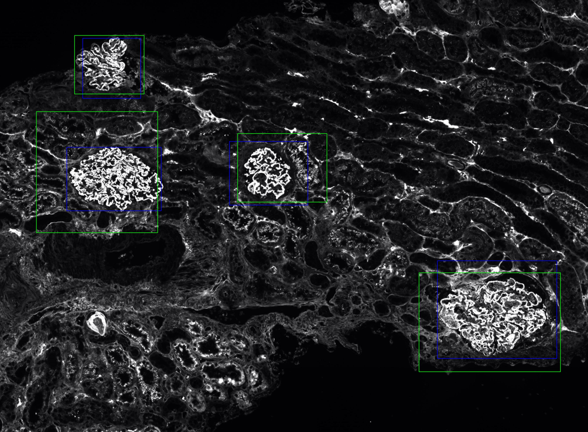

# Glomeruli Detection

This repository contains a project aimed at detecting glomeruli in histopathological images using deep learning techniques. The goal is to build an automated system for identifying and segmenting glomeruli regions in tissue slide images, which is useful for various medical applications, including kidney disease diagnosis.

## Project Overview

The project uses **YOLOv8**, a state-of-the-art object detection model, to identify glomeruli in large-scale Whole Slide Images (WSI). The dataset used for training and validation contains annotations in the form of bounding boxes around glomeruli regions. The detection model is trained on these annotated data, and the output includes bounding boxes that mark the predicted glomeruli locations.

## Dataset

The dataset consists of 195 Whole Slide images (WSIs), of which 185 have been annotated by drawing a bounding box around each identified glomerulus. Each WSI is opened using the OpenSlide library, selecting the second resolution level (level 1, less detailed compared to level 0) to facilitate processing.

## Segmentation

Each WSI underwent a pre-processing step to separate the tissue portion from the background, resulting in a segmentation mask.

**Loading and Conversion**: The input image (WSI) is converted to grayscale to simplify further processing.

**Processing**: A binary mask is then generated, where pixels representing tissue are assigned a value of 1 (white), while background pixels are assigned a value of 0 (black). Pixels are selected based on a specified range of intensity values between a defined lower and upper bound. Morphological operations are subsequently applied to refine the mask by expanding tissue contours, filling small holes, and connecting adjacent regions, thereby improving segmentation quality.

**Validation**: Patch selection is guided by the generated mask, considering only patches containing a sufficient amount of tissue. Specifically, a patch is discarded if more than 80% of its area consists of background (i.e., it contains little to no tissue).

**Saving and Visualization:** The segmented mask is saved and overlaid on the WSI to facilitate visual inspection.

## Key Features
- **YOLOv8 Model**: Utilizes the YOLOv8 architecture for fast and accurate object detection.
- **Preprocessing**: Handles the segmentation and patching of WSIs for training purposes.
- **Custom Annotations**: Annotations in YOLO format are used for training and evaluation.
- **Prediction Visualization**: Draws bounding boxes around detected glomeruli and visualizes the results.

### Output Example Image:
- **Blue** represents the ground truth, while **green** represents YOLO aggregated predictions.

1. 
